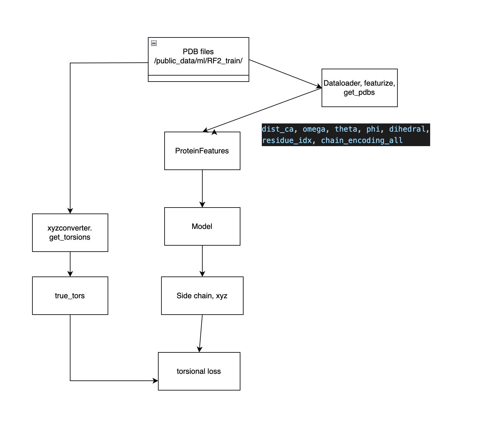

# <code style="color: blue;"> SCModel </code>
Build AI to predict side chain torsion angles from protein backbone coordinates!

### <code style="color: blue;"> Workflow for training model </code>

File: side_chain_modeling/train.py

PDB Files -> ProteinFeature -> DataLoader -> AI Model (Message passing neural network + Side chain Prediction module) -> side chain coordinate

PDB Files -> True side chain coordinate -> Compute Torsional Loss

### <code style="color: blue;"> Workflow to acquire xyz coordinates from trained model's output side chain coordinate </code>

File: side_chain_modeling/xyz_converter_predict.py

References:
1. Dauparas, Justas et al. “Robust deep learning based protein sequence design using ProteinMPNN.” Science (New York, N.Y.) 378 (2022): 49 - 56.
2. Yang, Jianyi et al. “Improved protein structure prediction using predicted interresidue orientations.” Proceedings of the National Academy of Sciences 117 (2019): 1496 - 1503.
3. Baek, M., Anishchenko, I.V., Humphreys, I.R., Cong, Q., Baker, D., & DiMaio, F. (2023). Efficient and accurate prediction of protein structure using RoseTTAFold2. bioRxiv.